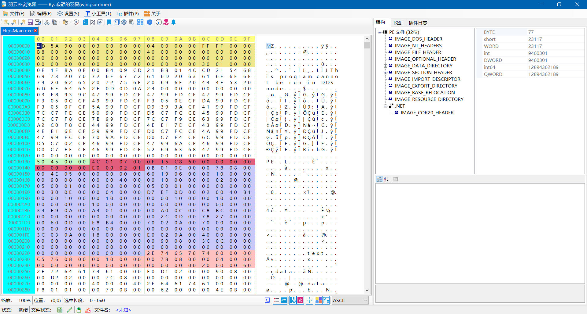

# WingSummer.PEHexExplorer

羽云PE浏览器

#### 介绍
&emsp;&emsp;本软件由纯C#编写，基于我改良的 Be.Windows.Forms.HexBox 组件( https://gitee.com/wingsummer/be.-windows.-forms.-hex-box )【MIT协议】。目的是方便专业人士修改分析PE文件，并可作为学习PE结构的重要辅助工具。

#### 发个牢骚

&emsp;&emsp;我在 2021/7/28 开始对该项目的开发，当然之前也弄了一些筹备工作。于月底创建该仓库，第一次频繁使用 Git ，还不不小心把我的项目搞崩了一次，好歹我有备份。我之所以封闭仓库一方面由于程序还没有写个差不多，另一方面由于是Git的Beginner，搞崩了仓库还是开放的被同志看到了会尴尬的。本人于 2021/8/4 晚开放仓库，程序总的来说应该写了有八成了，目前程序最起码是一个比较合格的十六进制编辑器了，还有点 PE 结构分析的小功能。

&emsp;&emsp;我是怎么想开发这个项目，一个原因练一练我PE结构学的咋样，只学不练假把式，一段时间就忘了，还拾起来挺费劲，对其理解还是不够。另一个原因练一练 C# 开发的功底，之前一直在搞 C++ 开发，也累了，学的语言我自我感觉我不太系统，每一次开发总会学到一些我之前不知道的东西，还是不错的。最后一个原因是我从网上没有找到合适的开源的十六进制编辑器和 .Net 平台 PE 解析库，虽然是有一个 PE 解析库，程序一启动载入合法 PE 文件就崩了，看看实现原理直接利用字节数组，文件一大效率我感觉挺低的。我的实现方式是利用 FileMapping ，是 .Net 原生支持的，没有导入 API ，虽然 .Net 支持指针，但用的还是不如 C++爽，不过 C# 写 GUI 程序和代码真的挺好，已经封装了很多有用的东西。

【写于2021/8/4】

&emsp;&emsp;说不想写代码结果又连续写到今天，看来自己的学习计划又泡汤了:dog::dog::dog:。本来打算学习DotNet平台和系统内核的，现在大热天的，学不进去，结果又来写代码了（找借口），不过效率挺慢的。设置上面的设置有的也有了（除了书签的高级操作还有插件禁用），还有PE结构分析的Dll还没有完全完善，PE快速定位框架已经有了，插件框架已经有了，功能还没实现完。主界面最右下角部分那个PropertyGrid我是打算用来当前光标的PE结构的，不过还是搁置了。以后我的事情太多了，不能当全职码农了，也真正写够了（还不一定），不过没啥动力是真的 &#128540; 。

【写于2021/8/11】

#### 软件架构

1. Be.Windows.Forms.HexBox ：本组件由我改良的十六进制编辑组件Be.Windows.Forms.HexBox进一步增进使用，增加支持水平滚动条和一些其他接口（例如填充支持撤销恢复更改的数据接口）和代码整理，详情请看代码，现组件遵循本仓库的协议。
2. PEProcesser ：解析PE结构的重要组件，由本人编写，由于本人知识限制，dot平台的PE结构可能支持不完善，普通PE文件有些查询接口未编写封装，欢迎 issue 或者 pull request，本组件遵循本仓库协议。
3. PEHexExplorer ：本软件的主程序，提供GUI交互，遵循本仓库协议。

#### 使用声明

1.  本软件是为方便专业人士快速编辑定位PE文件的结构，同时也便于本人巩固或者学习PE知识以及C#编程。也可以作为初学者学习PE结构的重要辅助工具。
2.  本软件仅供学习交流使用，不得私自用于商业用途。如需将本软件某些部分用于商业用途，必须找我授权。
3.  本人学生，由于本软件是用我的业余时间编写，不能及时修复Bug或者提供技术支持，请见谅。
4.  本人非专业计算机，编写程序难免有Bug，欢迎提交 issue 。

#### 对 Be.Windows.Forms.HexBox 组件我增进了什么

1. 增加撤销和恢复更改
2. 整理代码，分块处理
3. 增加一些属性和事件
4. 增强底色标注
5. 修复选择色块填充比较难受的填充
6. 增强底色填充功能
7. 增强分割线和修复其已知Bug
8. 增加缩放功能
9. 增加Unicode的支持
10. 开放一些私有字段为只读属性，方便编码
11. 修改一些接口，增强功能
12. 增加封装好的文件打开，保存，导出功能函数

以上是依旧遵循 MIT 协议我修改增进的版本，本人不再维护了，下面是这个项目继续增进的功能，遵循现仓库协议：

1. 增加支持撤销的写入字节接口
2. 增加了水平滚动条的支持
3. 修复当编辑一个十六进制行在显示最后一行时，本行会上下横跳的 Bug
4. 增加与缓冲相关的接口，以供不用于编辑文件使用（比如查找搜索功能的十六进制搜索需要这个）
5. 增加一些属性，提高自定义性
6. 修复水平滚动条导致绘制需重新定位和选择问题
7. 增强滚动条是否应该显示占空的问题（即修复 **“你让我需要显示，不管空够不够，我都站着这个坑”** 的小 Bug ）
8. 修复删除字节而光标仍在原位置（现编辑字节长度区域外部）导致的异常
9. 增加越界锁（通俗的说就是在指定范围内随意，想增加字节长度没门）
10. 增加修改字节时，范围小导致可视字节比较少时，设置为使用滚动条自动定位到合适位置。（虽然原先垂直滚动条做好了，但有 Bug ，会导致 **3** 所述问题）
11. 自定义文件基址功能
12. 增加对进程读写内存函数类的包装以实现读写进程主模块内存功能（写入内存暂未测试）
13. 增加支持64位地址支持

#### 参与贡献

1.  如果您有想参与本软件代码开发递交，请在 pull request 联系我。
2.  本项目支持捐助，如有意愿请到本仓库通过微信或者支付宝的方式进行，本人不喝奶茶，一瓶水的价钱足以提高我的维护该项目的热情，感谢大家的支持。
3.  如果您想提交修复或者增进程序的代码，请在 pull request 递交。
4.  任何成功参与代码Bug修复以及增进程序功能的同志和Sponsor，都会在本仓库ReadMe和附属说明文件中体现，您如果是其中之一，本人可以按照您合理的意愿来进行说明。

#### 效果图

#### 未来的打算（如果有时间且想写代码的话）

1. 增强 PE 分析的 Dll 的功能，对于 .Net PE 的知识我的认识我还不是特别全面，有时间我会研究 DotNet 平台的运行原理和机制，再回来搞搞。
2. 完成插件系统所有功能（基本框架和最基本的功能实现）
3. 把设置项目更加完善，把书签和禁用插件功能写好
4. 完成书签的支持

#### 捐助

感谢支持

感谢支持

